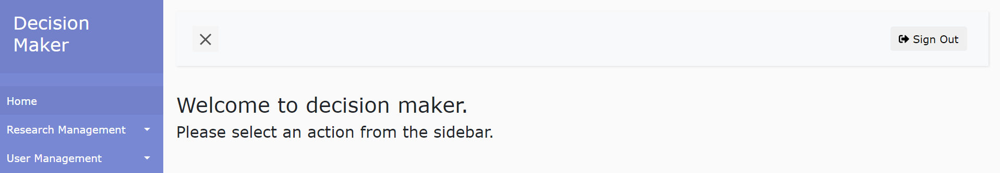
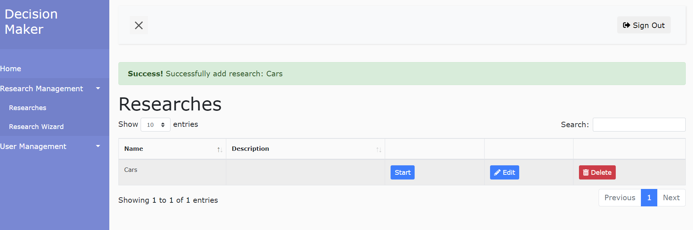
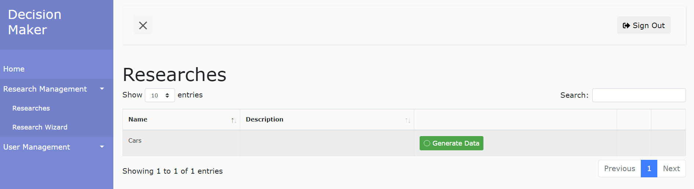
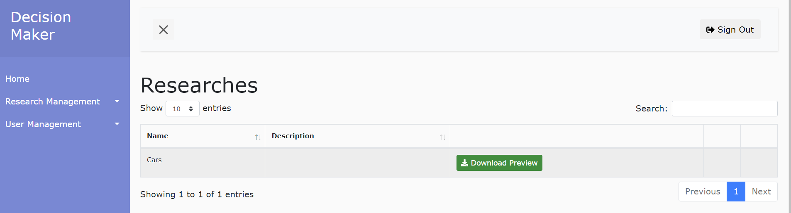
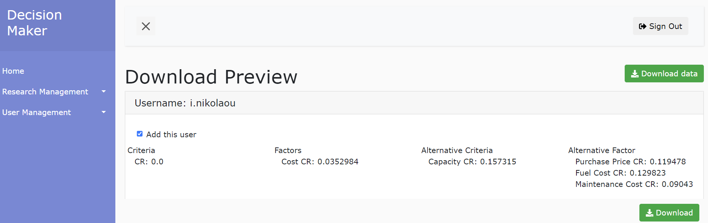
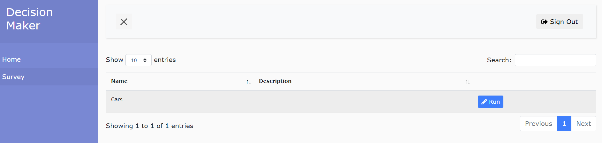
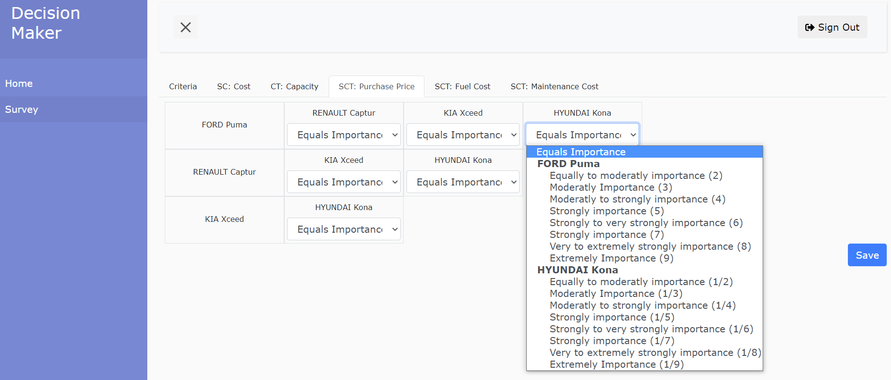

# Decision Survey Platform
A simple decision making tool written in JAVA and HTML.

## Table of contents
- [Description](#description)
- [Installation](#installation)
- [Usage](#usage)

## Description
Web tool to assist in complicated decision making problems, utilising the AHP methodology. This application extensively uses algorithms in order to solve a problem, by calculating weights for each criterion, factors that represent the criteria, and the alternative solutions of a target, under the influence of a factor. This online application was implemented by using JAVA & HTML, an SQL database and NIST math library, which are used to calculate eigenvalues and eigenvectors that help evaluating the weights for each criteria, factor and alternative.

The application enables the researcher to create a survey, to determine a group of users who participate in the research, to collect responses, and export results. Each user has the opportunity to take part in a survey.
The tool's implementation demonstrates the convenience that a researcher can conduct a survey through a decision-making service, using simple data forms and programming structures. Furthermore, through this service, materialized algorithms of decision-making are provided, in order to help finding the optimal solution in a more rapid and easier way.

## Installation

### Docker engine
For the deployment of the web server, docker engine is required. Docker Engine is an open source containerization technology for building and containerizing your applications. Docker Engine is available on a variety of operation systems (Linux platforms, Windows, etc). Choose your preferred platform's guide from [here](https://docs.docker.com/engine/install/).

### Run the project
Open a command line and run the following commands
```
git clone https://github.com/gdede-hua/Decision_Survey_Platform.git
cd Decision_Survey_Platform
```
> Note: We strongly suggest to adjust the .env file according to your needs, as it contains sensitive data.

If you want to run the project with docker then in the `Decision_Survey_Platform` folder run.
```
docker-compose up
```

### Docker Ports
The application port is 8080. The link of the application is http://localhost:8080.
The MySQL port is 3306.

In case one would like to edit the above ports he/she may edit the .env file.

### Credentials
The are default administrator and user accounts and the related credentials are presented below:

DEFAULT_ADMIN_USER=admin

DEFAULT_ADMIN_PASSWORD=password


DEFAULT_SIMPLE_USER=user

DEFAULT_SIMPLE_PASSWORD=password

In case one would like to edit the above ports he/she may edit the .env file.

## Usage
The tool is user friendly with clear - easy to follow - procedures.

The site is separated by user accounts and administrator accounts. 

The administrator can:

* Create, modify and delete surveys
* Assign users to answer a survey
* Extract survey results based on the user answers

On the other hand a user can:
* Answer an assigned survey

### Administrator
The administrator can find all the possible actions in a sidebar in his main screen.



#### Creating a survey
The administrator will have to complete a form for the creation of a survey.
>Note: The administrator can edit the survey before publishing to users, by visiting the `Survey` link in the sidebar




#### Group of Users
When the research is created, the next step is to make a user group of users to answer the research. This can be achieved by pressing the `Group of Users` button in the sidebar


#### Start Research
Next we are ready to start the research. By clicking `Start` the system opens a modal, where we must select the `Group of Users` and the expiration date of the research. When we press the buton `Start Reasearch` we let the system know that the research is ready to receive answers. Once the research is started it cannot be edited anymore. By default, a research is considered complete when the end date has passed.


#### Generating results of completed research
A research is completed when the expiry date has passed. We can click on the button `Generate Data` and the system will start calculating the Eigenvalues and Eigenvectors for each user answer. Then, based on the weights derived from the eigenvectors, a ranking of the alternatives is calculated.



By clicking the `Download Preview` button, we can get the results in an Excel file.




### User
The user is more simplyfied than the administrator. A user is only able to answer an assigned research.
Below you may find example answers for an assigned research.




## Code Information's


* The package `com.hua.controller` have all the controllers needed for communication with the Frontend.
* The package `com.hua.model` have all the models of the app.
* The package `com.hua.repository` have all the JPA endpoints which the app uses.
* The package `com.hua.security` have the security of the app.
* The package `com.hua.util` have some general classes.
  * The class `com.hua.util.AesEncryptor` used for sensitive information encryption.
  * The class `com.hua.util.DatabaseLoader` used onm first start up to create the default users and the menu.
  * The class `com.hua.util.GenerateAhpExcel` create an Excel with the research results.
  * The class `com.hua.util.GenerateDataExcel` Create ab Excel with th survey answers.
  * The class `com.hua.util.JwtUtil` used to generate unique token for the reset password mechanism.
  * The class `com.hua.util.Mailer` send email to users like for the reset password.
  * The class `com.hua.util.RunAHP` it execute the AHP algorithm.
  * The class `com.hua.util.ScheduledTasks` check if a survey had expire.
  * The class `com.hua.util.ScheduledTasks` used for sensitive information encryption.
* The folder `resources` have the front end interface.
* The folder `test.java` have the JUnit tests.
* The file `application.properties` have all the necessary properties for the dataBase e.g.

## General Guidelines
-Third parties that want to contribute to the software may have access to the related files and the source code.

-Anyone who wants to report an issue or a problem with the software may open an issue in the software repository in Github.

-Anyone who seeks for support regarding the installation/usage of the software may open an issue in the software repository in Github.
