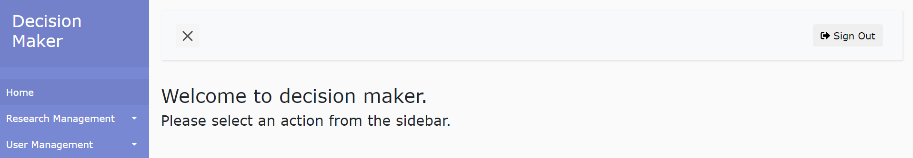
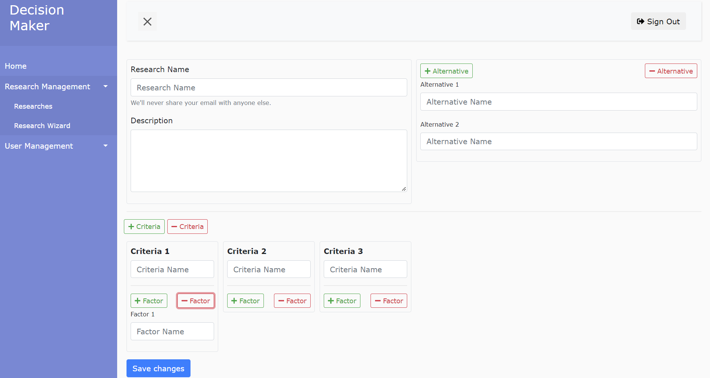
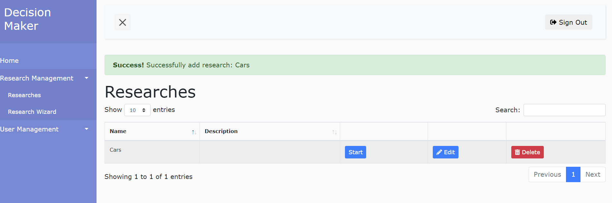
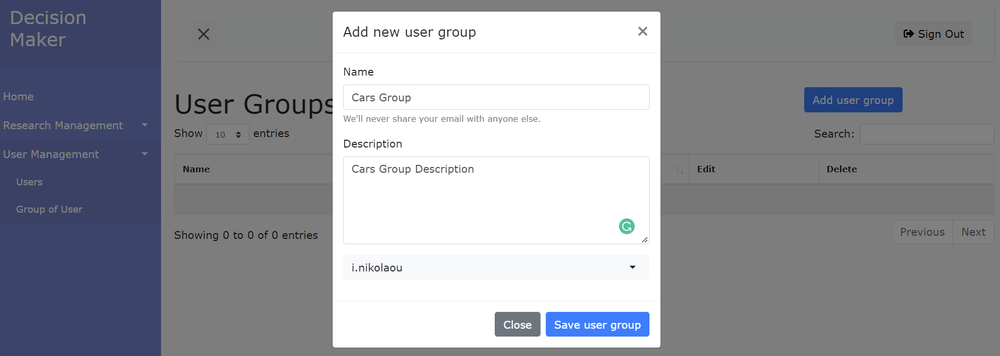
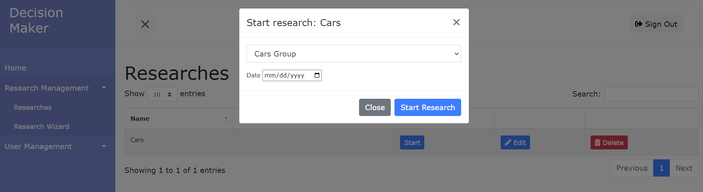
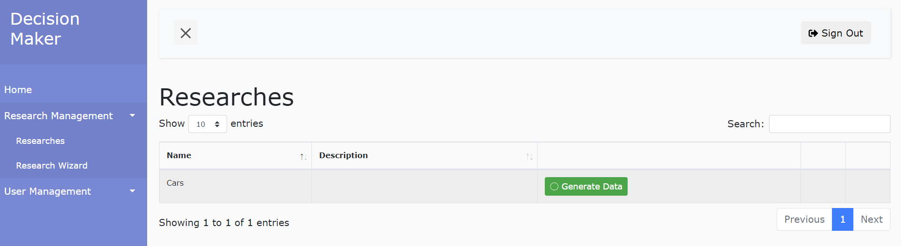
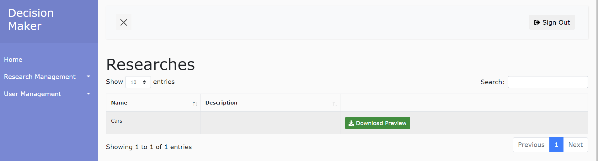
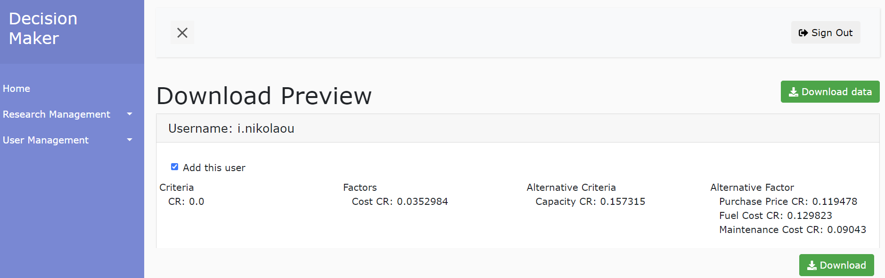
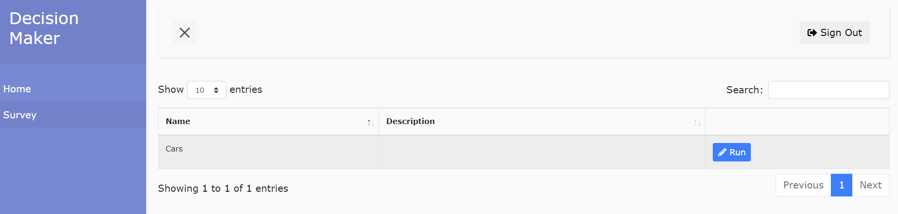
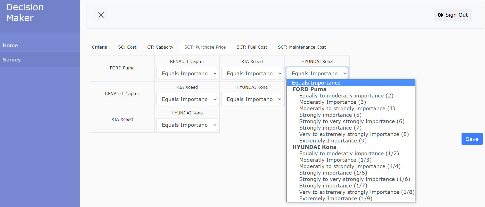

# Summary 

The DecisiOn sUpport weB plaTform (NO-DOUBT) aims to assist in
complicated multicriteria decision making problems, using the Analytic
Hierarchy Process (AHP). The AHP has been used around the world in a
wide variety of decision situations, in fields such as government,
business, industry,healthcare, education, project management
[@chan2006ahp;@dede2010evaluation;@drake1998using;@lee2006investigating;@liberatore2008analytic;@saaty2003decision].

This application, extensively uses algorithms in order to solve a
multicriteria problem, calculating weights for each criterion, factors
(sub-criteria) that characterize the criteria, and the alternative
solutions of a target. This online application was implemented by using
JAVA and HTML.

The NO-DOUBT tool offers a web based interface in order to create a
survey, to determine a group of users who participate in the survey, to
collect responses, and export results. In this context, this platform
not only supports the AHP methodology but also the user administration,
the surveys development, the definition of decision making problems.
Each user has the opportunity to participate in a survey and view the
results of previous surveys. Towards this end, there are two different
interfaces, these of administrator and user with separate
functionalities. The tool’s implementation demonstrates the convenience
that a decision maker can conduct a survey through a decision-making
service, using simple data forms and programming structures.
Furthermore, through this service, materialized algorithms of
decision-making based on AHP are provided, in order to help finding the
optimal solution in a rapid and easy way.

This tool is a web based supporting tool for decision making that can be
helpful both for daily simple decision problems and complex decision
making problems in every day life, organizations, academia and
industries.

# Statement of Need 

Inspection of previous efforts reveals that there is a variety of tools
that support the AHP methodology either commercial or open source (OSS).

For example, super decisions software [@Superdecisions] is a free
educational software. It is the only free educational software that
implements AHP and was developed by the team of the creator of the
method, Thomas Saaty. Its development and maintenance is sponsored by
Creative Decisions Foundation. Moreover, the expert choice
[@Expertchoice] combine collaborative team tools and proven mathematical
techniques based on decision making methods such as the AHP. The
concluder [@Concluder] is a simple tool for complex decision making
using the consistency-driven pairwise comparisons method (CDPC) which is
primarily for multi-criteria decision making, such as the AHP. The
AHP-software [@AHP-Software] is also used to solve the AHP in decision
making and operation research. The spicelogic AHP Software
[@AHP_Software-30] captures the AHP methodology

Furthermore, open source software have been also developed for the AHP.
More specifically, the AHP-OS [@AHP-OS] is a free web based AHP tool for
decision making processes. The AHP with R [@AHP-R] is an R package to
model complex decision making problems using AHP. There are also other
efforts that suppoty part or the whole AHP algorithm such as
[@Paulgovan;@Andrugo;@Airiyu;@Humberoroa;@Pvlhx;@Hogivano].

Even though there are several software that support AHP there is no
single solution that offers a web based platform which both
administrator and user functionalities. Most of the already developed
AHP software integrate only the AHP algorithm. The NO-DOUBT tool
supports the development of surveys, the management of users
(registration, login) as well as the application of the AHP algorithm
with extraction functionalities for further use of the results. There
are many directions for future expansion of this tool. Towards this end,
the authors have already begun to incorporate their research
contributions in the field of decision making and more specifically, the
estimation of the probability of rank reversal in order to investigate
the stability of the final
outcomes[@dede2015convergence;@dede2016theoretical].

# AHP Methodology 

AHP is a multi-criteria decision making methodology which adopts a
hierarchical form using three conceptual levels. In the first level, the
objective is defined (e.g. the evaluation of technologies for home
networking based on a set of alternative solutions). In the next level,
we identify a number of criteria $N$ on which our evaluation will be
based. Each criterion $C_k$ is an important aspect of the decision
making problem and is further identified by its factors at the third
level of the hierarchy. A factor $F_{j_k}$ is an indicative attribute
that characterizes a criterion (e.g., downstream throughput is a factor
of performance criterion for home networking technologies).

In order to rate the alternative solutions, one must first evaluate the
weights of the criteria $w_k$ and the factors $f_{j_k}$. Toward this
end, each expert $m$ performs a series of PWCs by filling out a table
containing the upper triangular elements based on a certain scale (e.g.
the nine level scale). The diagonal elements of the PWC are set equal to
one, while the lower triangular elements are calculated as the
reciprocal of the upper ones.

The criteria weights for the $m$ expert are obtained by the elements of
the eigenvector corresponding to the maximum eigenvalue of the PWC
matrix.

A similar procedure is followed for the estimation of the weights of the
factors $f_{jk}$ of each criterion. Finally, the alternatives are
pairwise compared according to each factor and for each alternative
$A_i$ one obtains the relative scores $S_{ijk}$ under factor $F_{jk}$.
The final ranking priorities $T_i$ of each alternative are evaluated by
multiplying the relative scores $S_{ijk}$ by the overall weight
$f_{j_k} · w_k$ of the corresponding factor as follows:

$$T_i=\sum_{k=1}^{N}\sum_{j=1}^{J_k}S_{ijk} f_{jk} w_k$$

# Functionalities 

The NO-DOUBT tool is user friendly with clear and easy to follow
procedures. The site is separated by user and administrator accounts.
The administrator can create, modify and delete surveys, assign users to
answer a survey and extract research results based on the user answers.
On the other hand a user can register and answer an assigned survey as
well as view his judgments and results.

# Administrator 

The administrator can find all the possible actions in a sidebar in his
main screen as presented below:

## Creating a Survey

The administrator will have to complete a series of simple PWC forms for the
creation of a survey. The AHP methodology requires the PWC survey to have at
least one criterion, at least one factor for each criterion and at least
one alternative. The administrator will have to provide the name and a
description for each element. The administrator can edit the survey
before publishing to users, by visiting the Research
link in the sidebar.

## Group of Users

When the survey is created, the next step is to make a user group of users to answer the PWC researches. This can be achieved by pressing the `Group of Users` button in the sidebar.

#### Start Research
Next we are ready to start the survey. By clicking `Start` the system opens a modal, where we must select the `Group of Users` and the expiration date of the survey. When we press the buton `Start Reasearch` we let the system know that the survey is ready to receive answers. Once the survey is started it cannot be edited anymore. By default, a research is considered complete when the end date has passed.

## Generating results of completed research

A survey is completed when the expiry date has passed. We can click on the button `Generate Data` and the system will start calculating the Eigenvalues and Eigenvectors for each user answer. Then, based on the weights derived from the eigenvectors, a ranking of the alternatives is calculated.

By clicking the `Download Preview` button, we can get the results in an Excel file.

# User 

The user is more simplified than the administrator. A user is only able
to fill in an assigned survey and display previous results. 

Example answers for an assigned survey are presented below.

# Example
This section provides an example of the tool usefulness for a real case scenario. 
We consider the scenario of deciding which is the suitable technology to use in the vision of the all optical house. 
According to the AHP alternative technological have to be identified and ranked based. 
Towards this end, the administrator creates the PWC surveys/researches defining the criteria, factors under each criteria and alternative technological scenarios. 
More specifically, the above alternatives are considered:
- T1. Infrared 
- T2. Power Line Communications (PLC)
- T3. Visible Light Communications (VLC)

The criteria defined are presented below:
- C1. Performance
- C2. Economic Issues
- C3. Social Acceptance

The Factors under each criterion C1 are described below:
- F11. Reach
- F12. Coverage
- F13. Downstream Throughput
- F14. Upstream Throughput

The Factors under each criterion C2 are listed below:
- F21. Cost of Installation
- F22. Cost of Equipment
- F23. Installation Cost

The Factors under each criterion C3 follow:
- F31. Health Issues
- F32. Home Integration with no new wires/Design
- F33. Usability
- F34. Compatibility with legacy systems

In this context the administrator creates 15 PWC researches in order to be filled in by the experts/users. More specifically:
- 1. PWC of the Criteria
- 2. PWC of the Factors under C1
- 3. PWC of the Factors under C2
- 4. PWC of the Factors under C3
- 5. PWC of alternative technologies under F11.
- 6. PWC of alternative technologies under F12.
- 7. PWC of alternative technologies under F13.
- 8. PWC of alternati ve technologies under F14.
- 9. PWC of alternative technologies under F21.
- 10. PWC of alternative technologies under F22.
- 11. PWC of alternative technologies under F23.
- 12. PWC of alternative technologies under F31.
- 13. PWC of alternative technologies under F32.
- 14. PWC of alternative technologies under F33.
- 15. PWC of alternative technologies under F34.

Based on the above, 15 experts/users are called to fill in the corresponding PWC matrices in order to capture the importance of the criteria (which one is more important in pairs of two), the importance of the factors under each criterion as well as the performance of the technological alternatives under each factor. 

Once the experts have filled in the PWC researched then the administrator can press generate data in order the algorithm to estimate the weights of importance of criteria $w_{k}$ , factors $f_{jk}$ under each criterion and relative importance of alterantive technologies $S_{ijk}$ and the final priorities $T_{i}$ of the technologies as described in the AHP approach described above.

# References
